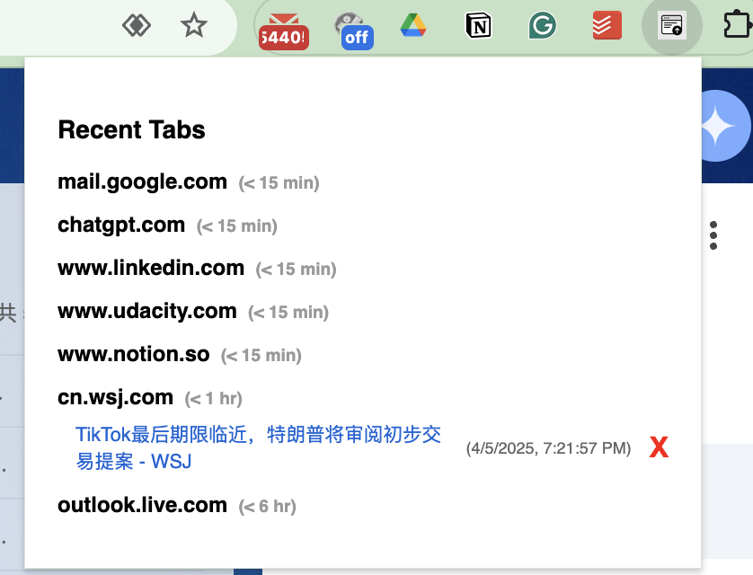

# 🔖 Recent Tabs Grouper – Chrome Extension



**Recent Tabs Grouper** is a Chrome extension that helps tab-heavy users stay organized and productive. It intelligently groups your open tabs by domain, shows the most recently accessed ones, and allows you to instantly reopen or close tabs — all from a simple popup.

---

## ⚡ Key Features

- 📂 Group open tabs by domain (with smart path filtering)
- 🕒 Display last active time for each tab
- 🔽 Expand/collapse tab groups for better focus
- 🟥 Close individual tabs directly from the popup
- 🧠 Group activity labeled by recency:  
  `<15 min`, `<1 hr`, `<6 hr`, `<1 day`, `<1 week`, or `≥1 week`

---

## 🧪 Installation (Local Testing)

1. Clone or download this repo:
   ```bash
   git clone https://github.com/andyhub1991/chrome_tab_grouper.git```
2. Open Chrome and go to `chrome://extensions/`
3. Enable Developer mode (top right)
4. Click “Load unpacked” and select the project folder
5. Click the extension icon in the toolbar to open the popup
